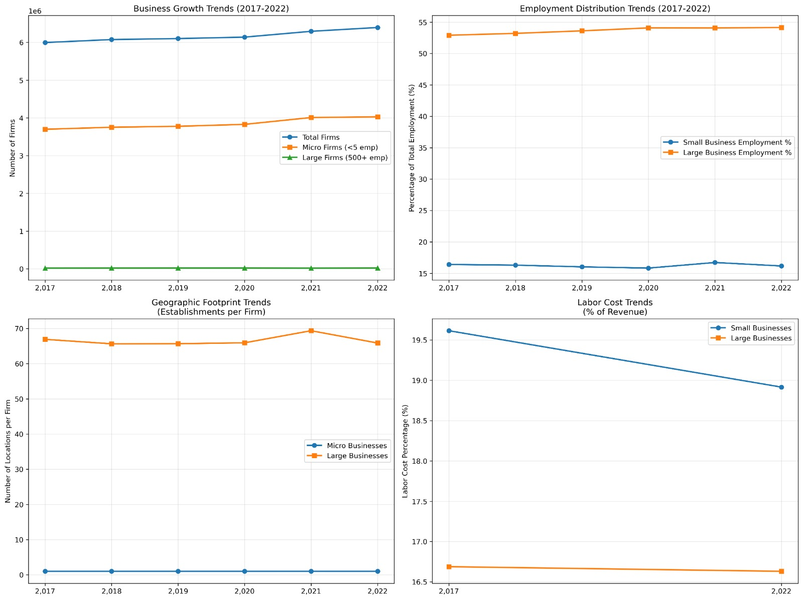
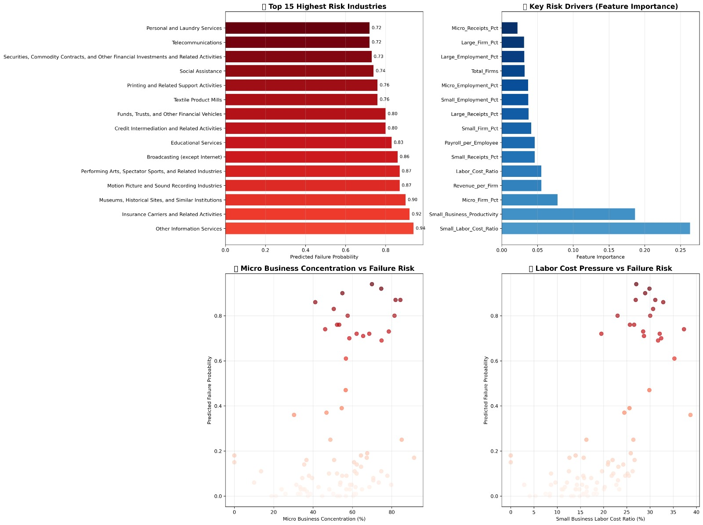

# small-business-failure-prediction
AI-driven analysis of U.S. small business survival, failure risk, and economic trends using SBA and BLS data (2017-2022). Includes predictive modeling, visual dashboards, and policy insights.
# AI-Driven Small Business Failure & Survival Analysis (USA, 2017–2022)


---

## 📌 Project Overview  
This project develops a data-driven, AI-supported framework to analyze **U.S. small business survival, failure risk, and economic resilience** using multi-year datasets from the **U.S. Small Business Administration (SBA)** and **U.S. Bureau of Labor Statistics (BLS)**.

The goal is to quantify business vulnerability, identify high-risk industries, and support policy-level decision-making using predictive modeling and economic indicators.

---

## 🎯 Key Capabilities
✅ Multi-year business trend analysis (2017–2022)  
✅ Survival & failure rate modeling using BLS cohort data  
✅ Industry-level failure risk prediction (Random Forest, AUC ≈ **0.992**)  
✅ Labor cost, receipts share, employment distribution analytics  
✅ Automatic “high-risk sector” classification with policy recommendations  
✅ Fully reproducible Jupyter Notebook

---

## 📂 Included in this Repository

| File | Description |
|-------|-------------|
| `small_business.ipynb` | Full analysis notebook (EDA, ML model, plots, insights) |
| `us_business.csv` | SBA business dataset (firm size, payroll, employment, receipts) |
| `us_business_year.csv` | Industry-level business dataset by year |
| `us_business_new.csv` | Cleaned & normalized version of SBA data |
| `bls.csv` | BLS cohort-based business survival & failure dataset |
| `requirements.txt` | Python dependencies |
| Images (`.jpeg`) | Rendered charts used in README |

---

## 📊 Key Visual Outputs

#### 1️⃣ Multi-Year Business Trend Analysis (SBA)


#### 2️⃣ High-Risk Industry Probability Dashboard


#### 3️⃣ Receipts vs Labor Cost Comparison


#### 4️⃣ BLS Failure Rate Heatmap / Cohort Survival


---

## 📈 Predictive Modeling Summary
| Model | Type | AUC Score |
|--------|------|----------|
| Random Forest | Classification | **0.992** |
| Gradient Boosting | Classification | 0.964 |

**Top failure-risk drivers identified:**
- % of micro-enterprises in industry  
- Small-business labor cost ratio  
- Receipt share vs firm size  
- Productivity per firm  

---

## 📑 Research Background  
This repository also supports the author’s accepted IEEE research on AI-driven failure prediction for U.S. small businesses:

> **Mahmud, I. (2025). “AI-Enabled Small Business Survival Analysis in the United States.” IEEE ICECET 2025, Paris.**  
> (Included in EB-2 NIW petition evidence as economic policy impact research)

---

## 🚀 How to Run the Notebook

### 1️⃣ Install dependencies
```bash
pip install -r requirements.txt
